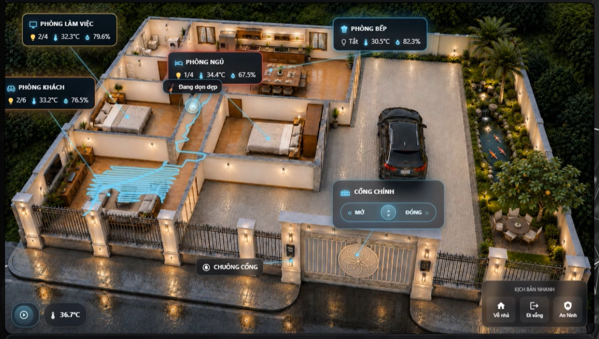

# 🏠 Floorplan Card

[](https://github.com/hacs/integration)


> 🇬🇧 **English version:** [README_en.md](README_en.md)

Card tùy chỉnh cho Home Assistant Lovelace — biến ảnh sơ đồ mặt bằng nhà thành dashboard tương tác: nhãn phòng hiển thị nhiệt độ/độ ẩm trực tiếp và điều khiển đèn, widget cổng (cover hoặc 3 công tắc rời), nút top-bar mở popup, kịch bản bấm nhanh, thanh trạng thái, và theo dõi vị trí/vệt đi của robot hút bụi (tuỳ chọn). Đi kèm trình chỉnh sửa trực quan kéo-thả đầy đủ với công cụ chỉnh vị trí riêng.

**Không cần plugin bổ sung. Vanilla JS thuần — không cần build, chỉ cần copy file vào là chạy.**

---

## 📸 Xem trước



---

## 🎛️ Visual Config Editor


---

## ✨ Tính năng (v1.0)

### 🎨 Hiển thị & Giao diện
- 🖼️ **Sơ đồ mặt bằng** — dùng bất kỳ ảnh nền nào (PNG/JPG/SVG), đặt nhãn phòng/cổng/nút theo toạ độ phần trăm trên ảnh
- 🏷️ **Nhãn phòng** — icon, tên phòng, chip nhiệt độ/độ ẩm trực tiếp, chip bật/tắt đèn — nối tới điểm neo trên ảnh bằng đường kẻ phát sáng
- 🌡️ **Gradient màu theo nhiệt độ** — viền/glow của nhãn phòng nội suy màu mát → vừa → nóng giữa các phòng đang hiển thị, chỉ cần liếc màu là biết phòng nào nóng hơn mà không cần đọc số; phòng vượt ngưỡng cấu hình sẽ nhấp nháy cảnh báo
- 🖱️ **Chạm để điều khiển** — chạm tên phòng để mở more-info của đèn đầu tiên, chạm chip đèn để bật/tắt toàn bộ đèn trong phòng cùng lúc
- 📍 **Đường neo** — mỗi nhãn phòng nối tới 1 điểm trên ảnh bằng đường kẻ + chấm phát sáng mềm mại

### 🚪 Widget Cổng / Cửa chính
- **Chế độ cover** — gắn với 1 entity `cover` duy nhất; thanh trượt mở/đóng hiển thị trạng thái thật
- **Chế độ 3 công tắc** — gắn riêng công tắc `open` / `close` / `stop` khi không có entity cover nào báo trạng thái; thanh trượt chuyển sang kiểu kéo trung tính (tự bật lại giữa)
- Nút **Dừng** tuỳ chọn, nhãn mở/đóng tuỳ chỉnh, và vị trí độc lập trên sơ đồ

### 🕹️ Nút Popup Top-Bar
- Số lượng nút không giới hạn, mỗi nút có icon, nhãn và **action** riêng: `navigate`, `more-info`, `popup` (stream camera **hoặc** popup nội dung tự do + ảnh), `toggle`, `call-service`, hoặc `url`
- Mặc định nút nằm ở hàng góc trên-phải, hoặc có thể kéo tới vị trí tuỳ ý trên ảnh giống như cổng
- Popup camera mở khung nhỏ gọn ngay trong card (không dùng dialog mặc định của HA); popup nội dung hỗ trợ tiêu đề, văn bản nhiều dòng và ảnh tuỳ chọn

### 🎬 Kịch bản bấm nhanh
- Hàng nút scene/script/automation với icon + nhãn
- Khi bấm, nút hiển thị **hiệu ứng glow xoay viền** trong lúc entity liên kết đang hoạt động, giúp xác nhận trực quan là kịch bản đã thực sự chạy

### 📊 Thanh trạng thái
- Hàng chip thống kê nhỏ (icon + nhãn + trạng thái entity + đơn vị) cho nhiệt độ ngoài trời, độ ẩm, số người trong nhà, công suất tiêu thụ hiện tại, số camera đang hoạt động, hoặc bất kỳ thông tin nào bạn muốn xem nhanh ở đầu card

### 🤖 Theo dõi robot hút bụi (tuỳ chọn)
- Chấm vị trí robot trực tiếp trên sơ đồ, tính bằng **phép biến đổi homography** (từ 4+ điểm hiệu chỉnh) nên vẫn đúng trên ảnh phối cảnh/isometric, không chỉ bản đồ top-down phẳng
- **Vệt đường đi** — vẽ lại đường robot vừa di chuyển trong phiên dọn dẹp, tự mờ dần sau một khoảng thời gian cấu hình khi robot về sạc/đứng yên
- Hiển thị sensor trạng thái/lỗi tuỳ chọn và công tắc hoán đổi trục X/Y cho hệ toạ độ robot bị lệch

### 🎛️ Trình chỉnh sửa trực quan
- Entity picker cho phòng (nhiệt độ, độ ẩm, đèn — chọn nhiều), cổng, nút top-bar, scene, thanh trạng thái và robot
- **Công cụ chỉnh vị trí kéo-thả tích hợp sẵn** — phủ ảnh sơ đồ với các chấm có thể kéo cho từng nhãn phòng, điểm neo, cổng, nút top-bar và điểm hiệu chỉnh robot; kéo để đặt vị trí, không cần tính tay số phần trăm
- Thêm / xoá / sắp xếp lại phòng, nút, scene, mục trạng thái và điểm hiệu chỉnh từ các mục có thể thu gọn

### 🛡️ Khả năng chịu lỗi
- Tự phục hồi khi render lỗi: nếu 1 lượt render bị lỗi (race condition lúc `hass`/states chưa sẵn sàng), card hiển thị trạng thái lỗi nhỏ và tự động thử lại ở lần cập nhật `hass` kế tiếp thay vì bị trắng vĩnh viễn
- Cơ chế hash kiểu `shouldUpdate` — chỉ render lại khi entity thực sự được khai báo trong config đổi state, không phải mỗi lần `hass` cập nhật

---

## 📦 Cài đặt

### Cách 1 — HACS (khuyến nghị)

**Bước 1:** Thêm Custom Repository vào HACS:

[](https://my.home-assistant.io/redirect/hacs_repository/?owner=doanlong1412&repository=floorplan-card&category=plugin)

> Nếu nút không hoạt động, thêm thủ công:
> **HACS → Frontend → ⋮ → Custom repositories**
> → URL: `https://github.com/doanlong1412/floorplan-card` → Type: **Dashboard** → Add

**Bước 2:** Tìm **Floorplan Card** → **Install**

**Bước 3:** Hard-reload trình duyệt (`Ctrl+Shift+R`)

---

### Cách 2 — Thủ công

1. Tải [`floorplan-card.js`](https://github.com/doanlong1412/floorplan-card/releases/latest)
2. Sao chép vào `/config/www/community/floorplan-card/floorplan-card.js`
3. Vào **Settings → Dashboards → Resources** → **Add resource**:
   ```
   URL:  /local/community/floorplan-card/floorplan-card.js?v=1.0
   Type: JavaScript module
   ```
4. Hard-reload trình duyệt (`Ctrl+Shift+R`)

---

## 🖼️ Chuẩn bị ảnh sơ đồ mặt bằng

Card cần 1 ảnh nền để phủ mọi thứ lên trên.

1. Chuẩn bị ảnh nhìn từ trên xuống (hoặc isometric) của nhà bạn — bản vẽ mặt bằng, ảnh xuất từ SVG sang PNG, hoặc thậm chí sơ đồ tự vẽ đơn giản đều dùng được
2. Sao chép vào `/config/www/floorplan/house.png` (tạo thư mục nếu chưa có)
3. Khai báo trong card: `background_image: /local/floorplan/house.png`
4. Đặt `aspect_ratio` khớp với tỉ lệ chiều rộng/cao thật của ảnh (ví dụ `16/9`, `4/3`, `1/1`) để ảnh không bị méo

> Toàn bộ vị trí phòng/cổng/nút đều tính theo **phần trăm (0–100) chiều rộng và chiều cao của ảnh**, nên bố cục luôn đúng ở mọi kích thước màn hình. Dùng **công cụ chỉnh vị trí** tích hợp trong trình chỉnh sửa để kéo-thả thay vì đoán số tay.

---

## ⚙️ Cấu hình Card

### Bước 1 — Thêm card vào dashboard

```yaml
type: custom:home-floorplan-card
background_image: /local/floorplan/house.png
```

Sau khi thêm, nhấn **✏️ Edit** để mở Config Editor.

### Bước 2 — Các phần trong Config Editor

| # | Phần | Nội dung |
|---|------|----------|
| 1 | 🖼️ **Chung** | Ảnh nền, tỉ lệ khung hình |
| 2 | 🏷️ **Phòng** | Thêm/xoá phòng, entity picker cho đèn/nhiệt độ/độ ẩm, icon |
| 3 | 🚪 **Cổng** | Chế độ điều khiển (cover hay 3 công tắc), entity picker, nhãn |
| 4 | 🕹️ **Nút top-bar** | Thêm/xoá nút, loại action, icon/nhãn, trường riêng theo từng action |
| 5 | 🎬 **Kịch bản** | Thêm/xoá nút scene/script |
| 6 | 📊 **Thanh trạng thái** | Thêm/xoá chip thống kê |
| 7 | 🤖 **Robot** | Entity camera/vacuum, điểm hiệu chỉnh, cài đặt vệt đi |
| 8 | 📍 **Chỉnh vị trí** | Lớp phủ kéo-thả để đặt từng nhãn/điểm neo/nút/điểm hiệu chỉnh |

---

## 🔌 Tham chiếu thực thể

### Cấu hình từng phòng (`rooms`)

| Config key | Kiểu | Bắt buộc | Mô tả |
|---|---|---|---|
| `id` | string | ✅ | ID phòng, duy nhất |
| `name` | string | ✅ | Tên hiển thị trên nhãn |
| `icon` | string | | Icon MDI, ví dụ `mdi:sofa` (mặc định: `mdi:home-outline`) |
| `temp_entity` | `sensor` | | Cảm biến nhiệt độ — hiển thị dạng chip và dùng cho gradient màu nhiệt độ |
| `humidity_entity` | `sensor` | | Cảm biến độ ẩm — hiển thị dạng chip |
| `light_entities` | list `light`/`switch` | | Các đèn được bật/tắt cùng lúc qua chip đèn của phòng; badge hiển thị `n/tổng` |
| `label_position` | `{x, y}` | | Vị trí % của nhãn phòng trên ảnh |
| `anchor_position` | `{x, y}` | | Vị trí % của điểm mà đường neo của nhãn chỉ tới |

### Cấu hình cổng (`gate`)

| Config key | Kiểu | Mô tả |
|---|---|---|
| `control_mode` | string | `cover` (mặc định, 1 entity cover) hoặc `switches` (3 công tắc rời) |
| `entity` | `cover` | Entity cover — dùng khi `control_mode: cover` |
| `open_entity` / `close_entity` / `stop_entity` | `switch` | Dùng khi `control_mode: switches` |
| `show_stop_button` | boolean | Đặt `false` để ẩn nút Dừng dù đã khai báo `stop_entity` |
| `name` | string | Nhãn hiển thị trên widget cổng |
| `open_label` / `close_label` | string | Chữ tuỳ chỉnh trên thanh trượt |
| `open_state_label` / `closed_state_label` | string | Trạng thái tuỳ chỉnh hiển thị dưới tiêu đề |
| `position` / `anchor_position` | `{x, y}` | Vị trí % trên sơ đồ |

### Cấu hình nút top-bar (`top_bar_buttons`)

| Config key | Kiểu | Mô tả |
|---|---|---|
| `icon` / `label` | string | Icon và chữ hiển thị |
| `action` | string | `navigate`, `more-info`, `popup`, `toggle`, `call-service`, `url` |
| `entity` | string | Entity đích cho `more-info` / `toggle` / `popup` (camera) |
| `navigation_path` | string | Dùng với `action: navigate` |
| `popup_type` | string | `camera` (mặc định) hoặc `content` |
| `popup_title` / `popup_content` / `popup_image` | string | Dùng với `popup_type: content` |
| `service` / `service_data` | string / object | Dùng với `action: call-service` (định dạng: `domain.service`) |
| `url_path` | string | Dùng với `action: url` |
| `position` / `anchor_position` | `{x, y}` | Tuỳ chọn — bỏ trống để giữ nút ở hàng mặc định góc trên-phải |

### Cấu hình kịch bản (`scenes`)

| Config key | Kiểu | Mô tả |
|---|---|---|
| `icon` / `label` | string | Icon và chữ hiển thị |
| `entity` | string hoặc list | Entity `scene`/`script`/`automation` (một hoặc nhiều) để gọi và theo dõi cho hiệu ứng glow đang hoạt động |

### Cấu hình thanh trạng thái (`status_bar`)

| Config key | Kiểu | Mô tả |
|---|---|---|
| `icon` / `label` | string | Icon và chữ hiển thị |
| `entity` | string | Entity bất kỳ để đọc trạng thái |
| `unit` | string | Hậu tố thêm sau trạng thái, ví dụ `°C`, `%`, ` kW` |

### Cấu hình robot (`robot`, tuỳ chọn)

| Config key | Kiểu | Mô tả |
|---|---|---|
| `entity` | `camera` | Entity nguồn chứa attribute vị trí để vẽ chấm robot |
| `position_attribute` | string | Tên attribute chứa toạ độ `{x, y}` của robot (mặc định: `robot_position`) |
| `vacuum_entity` | `vacuum` | Dùng để phát hiện trạng thái đang dọn/đã sạc và điều khiển vệt đi |
| `status_entity` / `error_entity` | `sensor` | Sensor trạng thái/lỗi tuỳ chọn hiển thị cạnh chấm robot |
| `icon` | string | Icon chấm robot |
| `swap_xy` | boolean | Hoán đổi X/Y nếu hệ toạ độ robot bị xoay so với ảnh |
| `calibration` | list `{room, robot: {x,y}, image: {x,y}}` | 4+ cặp điểm ánh xạ toạ độ thật của robot sang vị trí % trên ảnh sơ đồ, dùng để tính phép biến đổi homography |
| `trail.enabled` | boolean | Bật/tắt vệt đường đi |
| `trail.fade_after_minutes` | number | Thời gian vệt còn hiển thị sau khi robot về sạc/đứng yên (mặc định: 10) |

### Cấu hình cấp card

| Config key | Kiểu | Mặc định | Mô tả |
|---|---|---|---|
| `background_image` | string | — | **Bắt buộc.** Đường dẫn ảnh sơ đồ, ví dụ `/local/floorplan/house.png` |
| `aspect_ratio` | string | `16/9` | Tỉ lệ khung hình ảnh, ví dụ `16/9`, `4/3`, `1/1` |
| `rooms` | array | `[]` | Danh sách đối tượng phòng (xem trên) |
| `gate` | object | — | Cấu hình widget cổng (xem trên) |
| `top_bar_buttons` | array | `[]` | Danh sách đối tượng nút (xem trên) |
| `scenes` | array | `[]` | Danh sách đối tượng nút scene (xem trên) |
| `status_bar` | array | `[]` | Danh sách đối tượng chip thống kê (xem trên) |
| `robot` | object | — | Cấu hình theo dõi robot (xem trên) |

---

## 📝 Ví dụ YAML đầy đủ

```yaml
type: custom:home-floorplan-card
background_image: /local/floorplan/house.png
aspect_ratio: 16/9

rooms:
  - id: living
    name: Phòng khách
    icon: mdi:sofa
    temp_entity: sensor.living_temperature
    humidity_entity: sensor.living_humidity
    light_entities:
      - light.living_ceiling
      - light.living_lamp
    label_position: { x: 14, y: 17 }
    anchor_position: { x: 31, y: 21 }

  - id: kitchen
    name: Phòng bếp + ăn
    icon: mdi:silverware-fork-knife
    temp_entity: sensor.kitchen_temperature
    humidity_entity: sensor.kitchen_humidity
    light_entities:
      - light.kitchen_ceiling
      - light.kitchen_island
    label_position: { x: 38, y: 7 }
    anchor_position: { x: 47, y: 15 }

gate:
  entity: cover.cong_chinh
  name: Cổng chính
  control_mode: cover
  position: { x: 31, y: 62 }
  anchor_position: { x: 31, y: 54 }
  open_label: Vuốt để mở
  close_label: Vuốt để đóng

top_bar_buttons:
  - icon: mdi:doorbell-video
    label: Chuông cửa
    action: popup
    popup_type: camera
    entity: camera.chuong_cua
    position: { x: 18, y: 48 }
    anchor_position: { x: 23, y: 57 }

  - icon: mdi:shield-home
    label: An ninh
    action: navigate
    navigation_path: /lovelace/security

scenes:
  - icon: mdi:home
    label: Về nhà
    entity: scene.ve_nha
  - icon: mdi:weather-night
    label: Đi ngủ
    entity: scene.di_ngu

status_bar:
  - icon: mdi:thermometer
    label: Nhiệt độ ngoài trời
    entity: sensor.outdoor_temperature
    unit: "°C"
  - icon: mdi:lightning-bolt
    label: Tiêu thụ điện hiện tại
    entity: sensor.tong_cong_suat
    unit: " kW"

robot:
  entity: camera.vacuum_map
  vacuum_entity: vacuum.robot
  position_attribute: robot_position
  trail:
    enabled: true
    fade_after_minutes: 10
  calibration:
    - room: Phòng khách
      robot: { x: 1.2, y: 0.8 }
      image: { x: 20, y: 25 }
    - room: Phòng bếp
      robot: { x: 3.5, y: 0.8 }
      image: { x: 45, y: 12 }
    - room: Phòng ngủ
      robot: { x: 1.2, y: 3.0 }
      image: { x: 20, y: 55 }
    - room: Phòng làm việc
      robot: { x: 3.5, y: 3.0 }
      image: { x: 78, y: 45 }
```

### Ví dụ tối giản (chỉ có phòng, không cổng/scene/robot)

```yaml
type: custom:home-floorplan-card
background_image: /local/floorplan/house.png

rooms:
  - id: living
    name: Phòng khách
    icon: mdi:sofa
    light_entities: light.living_ceiling
    label_position: { x: 20, y: 30 }
    anchor_position: { x: 25, y: 35 }
```

---

## 🖥️ Tương thích

| | |
|---|---|
| Home Assistant | 2024.6+ |
| Lovelace | Dashboard mặc định & tùy chỉnh |
| Thiết bị | Mobile & Desktop |
| Phụ thuộc | Không — vanilla JS thuần, không cần build |
| Trình duyệt | Chrome, Firefox, Safari, Edge |
| Theo dõi robot | Tuỳ chọn — cần entity vacuum có attribute vị trí |

---

## 📋 Lịch sử thay đổi

### v1.0
- 🚀 Phát hành lần đầu
- 🏠 Sơ đồ mặt bằng với nhãn phòng theo toạ độ phần trăm, đường neo và chấm neo
- 🌡️ Gradient màu theo nhiệt độ giữa các phòng + ngưỡng nhấp nháy "nóng quá" có thể cấu hình
- 💡 Chip đèn phòng bật/tắt toàn bộ đèn trong phòng cùng lúc, kèm badge số đèn đang bật
- 🚪 Widget cổng với 2 chế độ điều khiển: 1 entity cover, hoặc 3 công tắc rời với thanh trượt trung tính tự bật lại giữa
- 🕹️ Nút popup top-bar — navigate, more-info, popup (camera/nội dung), toggle, call-service, url
- 🎬 Kịch bản bấm nhanh với hiệu ứng glow xoay viền khi đang hoạt động
- 📊 Chip thanh trạng thái có thể cấu hình
- 🤖 Chấm vị trí robot hút bụi qua phép biến đổi homography (4+ điểm hiệu chỉnh), hoạt động tốt trên sơ đồ phối cảnh/isometric
- 🧵 Vệt đường đi của robot tự mờ dần sau khi dọn xong
- 🎛️ Trình chỉnh sửa trực quan đầy đủ với công cụ chỉnh vị trí kéo-thả cho mọi phần tử
- 🛡️ Tự phục hồi khi render lỗi — tự thử lại sau lỗi tạm thời thay vì bị trắng
- ⚡ Cơ chế hash kiểu `shouldUpdate` — chỉ render lại khi entity được khai báo thực sự đổi trạng thái

---

## 📄 Giấy phép

MIT License — miễn phí sử dụng, chỉnh sửa và phân phối.
Nếu bạn thấy hữu ích, hãy ⭐ **star repo** nhé!

---

## 🙏 Credits

Thiết kế và phát triển bởi **[@doanlong1412](https://github.com/doanlong1412)** từ 🇻🇳 Việt Nam.

☕ [Ủng hộ tôi một ly cà phê](https://www.paypal.com/paypalme/doanlong1412)
