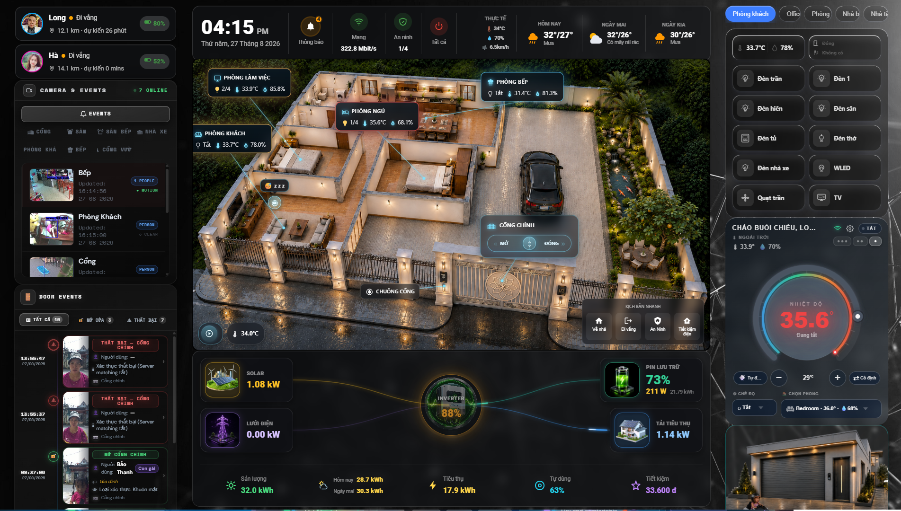
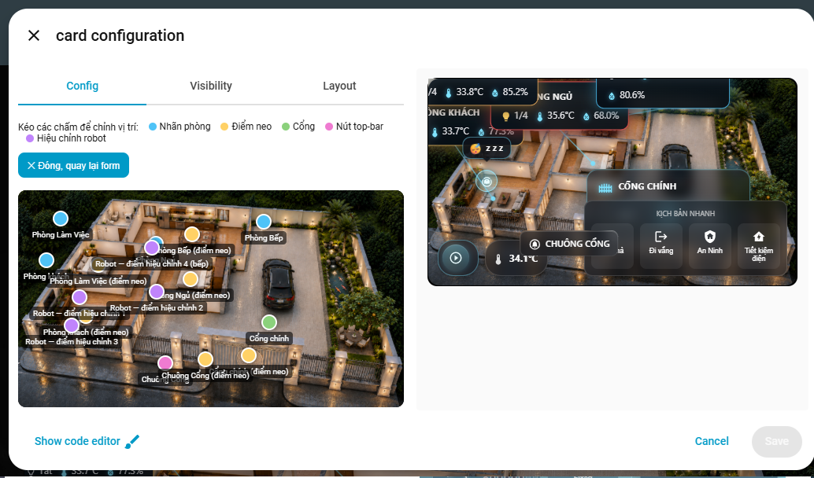

# 🏠 Floorplan Card

[](https://github.com/hacs/integration)


> 🇻🇳 **Phiên bản tiếng Việt:** [README.md](README.md)

A custom Home Assistant Lovelace card that turns a floorplan image into an interactive dashboard — room tags with live temperature/humidity and light control, a gate widget (cover or 3-switch control), popup top-bar buttons, one-tap scenes, a status bar, and optional robot-vacuum position/trail tracking. Includes a full drag-and-drop visual editor with a dedicated position editor.

**No extra plugins required. Pure vanilla JS custom element — no build step, just drop the file in and go.**

---

## 📸 Preview



---

## 🎛️ Visual Config Editor



---

## ✨ Features (v1.0)

### 🎨 Display & Interface
- 🖼️ **Floorplan overlay** — any background image (PNG/JPG/SVG) with room tags, gate, and buttons positioned by percentage coordinates
- 🏷️ **Room tags** — icon, name, live temperature/humidity chips, and a light on/off chip, connected to the room's anchor point on the image by a glowing line
- 🌡️ **Temperature gradient glow** — room tag border/glow color interpolates cool → warm → hot across the rooms currently shown, so the hottest room stands out at a glance without reading numbers; rooms above a configurable threshold also pulse
- 🖱️ **Tap to control** — tap a room name to open more-info on its first light, tap the light chip to toggle every light in that room at once
- 📍 **Anchor lines** — each room tag is linked to a point on the floorplan image via a soft glowing connector line + dot

### 🚪 Gate / Main Door Widget
- **Cover mode** — bind to a single `cover` entity; a slide-to-open/close track shows live open/closed state
- **3-switch mode** — bind separate `open` / `close` / `stop` switches when there's no single cover entity that reports state; the slider falls back to a neutral (spring-back) drag gesture
- Optional **Stop** button, custom open/close labels, and independent position on the floorplan

### 🕹️ Top-Bar Popup Buttons
- Up to any number of buttons, each with its own icon, label, and **action**: `navigate`, `more-info`, `popup` (camera stream **or** free-text/image content popup), `toggle`, `call-service`, or `url`
- Buttons default to a top-right row, or can be dragged to a custom position on the floorplan image like the gate
- Camera popups open a lightweight in-card frame (not the default HA dialog); content popups support a title, multi-line text, and an optional image

### 🎬 One-Tap Scenes
- A row of scene/script/automation buttons with icon + label
- Tapping fires a **rotating glow animation** while the linked entity is active, so you get visual confirmation the scene actually ran

### 📊 Status Bar
- A row of small stat chips (icon + label + entity state + unit) for outdoor temperature, humidity, occupancy, current power draw, active cameras, or anything else you want glanceable at the top of the card

### 🤖 Robot Vacuum Tracking (optional)
- Live position marker on the floorplan, computed from a **homography transform** (4+ calibration points) so it works correctly even on angled/isometric floorplan art, not just flat top-down maps
- **Movement trail** — draws the vacuum's recent path during a cleaning cycle, fading out automatically after a configurable number of minutes once docked/idle
- Optional status/error sensor display and axis-swap toggle for mismatched robot coordinate systems

### 🎛️ Visual Editor
- Entity pickers for rooms (temperature, humidity, lights — multi-select), gate, top-bar buttons, scenes, status bar, and robot
- **Built-in drag-and-drop position editor** — overlay the floorplan image with draggable dots for every room label, anchor point, gate, top-bar button, and robot calibration point; drag to place, no manual percentage math
- Add / remove / reorder rooms, buttons, scenes, status items, and calibration points from collapsible sections

### 🛡️ Resilience
- Self-healing render: if a render pass throws (race condition while `hass`/states are still loading), the card shows a small error state and automatically retries on the next `hass` update instead of staying blank forever
- `shouldUpdate`-style hashing — only re-renders when an entity actually referenced in the config changes state, not on every `hass` tick

---

## 📦 Installation

### Option 1 — HACS (recommended)

**Step 1:** Add Custom Repository to HACS:

[](https://my.home-assistant.io/redirect/hacs_repository/?owner=doanlong1412&repository=floorplan-card&category=plugin)

> If the button doesn't work, add manually:
> **HACS → Frontend → ⋮ → Custom repositories**
> → URL: `https://github.com/doanlong1412/floorplan-card` → Type: **Dashboard** → Add

**Step 2:** Search for **Floorplan Card** → **Install**

**Step 3:** Hard-reload your browser (`Ctrl+Shift+R`)

---

### Option 2 — Manual

1. Download [`floorplan-card.js`](https://github.com/doanlong1412/floorplan-card/releases/latest)
2. Copy to `/config/www/community/floorplan-card/floorplan-card.js`
3. Go to **Settings → Dashboards → Resources** → **Add resource**:
   ```
   URL:  /local/community/floorplan-card/floorplan-card.js?v=1.0
   Type: JavaScript module
   ```
4. Hard-reload your browser (`Ctrl+Shift+R`)

---

## 🖼️ Preparing Your Floorplan Image

The card needs a background image to overlay everything on top of.

1. Get a top-down (or isometric) image of your home — a floor plan render, an exported SVG-to-PNG, or even a simple drawn layout works
2. Copy it to `/config/www/floorplan/house.png` (create the folder if it doesn't exist)
3. Reference it in the card as `background_image: /local/floorplan/house.png`
4. Set `aspect_ratio` to match the image's actual width/height ratio (e.g. `16/9`, `4/3`, `1/1`) so it isn't stretched

> All room/gate/button positions are **percentages (0–100) of the image's width and height**, so the layout stays correct at any screen size. Use the built-in **position editor** in the visual editor to drag everything into place instead of guessing numbers by hand.

---

## ⚙️ Card Configuration

### Step 1 — Add the card to your dashboard

```yaml
type: custom:home-floorplan-card
background_image: /local/floorplan/house.png
```

After adding, click **✏️ Edit** to open the Config Editor.

### Step 2 — Config Editor sections

| # | Section | Contents |
|---|---------|----------|
| 1 | 🖼️ **General** | Background image, aspect ratio |
| 2 | 🏷️ **Rooms** | Add/remove rooms, entity pickers for lights/temperature/humidity, icon |
| 3 | 🚪 **Gate** | Control mode (cover vs 3 switches), entity pickers, labels |
| 4 | 🕹️ **Top-bar buttons** | Add/remove buttons, action type, icon/label, per-action fields |
| 5 | 🎬 **Scenes** | Add/remove scene/script buttons |
| 6 | 📊 **Status bar** | Add/remove stat chips |
| 7 | 🤖 **Robot** | Camera/vacuum entities, calibration points, trail settings |
| 8 | 📍 **Position editor** | Drag-and-drop overlay to place every label/anchor/button/calibration dot |

---

## 🔌 Entity Reference

### Room configuration (`rooms`)

| Config key | Type | Required | Description |
|---|---|---|---|
| `id` | string | ✅ | Unique room ID |
| `name` | string | ✅ | Display name on the tag |
| `icon` | string | | MDI icon, e.g. `mdi:sofa` (default: `mdi:home-outline`) |
| `temp_entity` | `sensor` | | Temperature sensor — shown as a chip and feeds the temperature glow gradient |
| `humidity_entity` | `sensor` | | Humidity sensor — shown as a chip |
| `light_entities` | list of `light`/`switch` | | Lights toggled together by the room's light chip; on-count badge shows `n/total` |
| `label_position` | `{x, y}` | | % position of the room tag on the image |
| `anchor_position` | `{x, y}` | | % position of the point the tag's connector line points to |

### Gate configuration (`gate`)

| Config key | Type | Description |
|---|---|---|
| `control_mode` | string | `cover` (default, single cover entity) or `switches` (3 independent switches) |
| `entity` | `cover` | Cover entity — used when `control_mode: cover` |
| `open_entity` / `close_entity` / `stop_entity` | `switch` | Used when `control_mode: switches` |
| `show_stop_button` | boolean | Set `false` to hide the Stop button even if `stop_entity` is set |
| `name` | string | Label shown on the gate widget |
| `open_label` / `close_label` | string | Custom text on the slide track |
| `open_state_label` / `closed_state_label` | string | Custom status text under the title |
| `position` / `anchor_position` | `{x, y}` | % position on the floorplan |

### Top-bar button configuration (`top_bar_buttons`)

| Config key | Type | Description |
|---|---|---|
| `icon` / `label` | string | Icon and text |
| `action` | string | `navigate`, `more-info`, `popup`, `toggle`, `call-service`, `url` |
| `entity` | string | Target entity for `more-info` / `toggle` / `popup` (camera) |
| `navigation_path` | string | Used with `action: navigate` |
| `popup_type` | string | `camera` (default) or `content` |
| `popup_title` / `popup_content` / `popup_image` | string | Used with `popup_type: content` |
| `service` / `service_data` | string / object | Used with `action: call-service` (format: `domain.service`) |
| `url_path` | string | Used with `action: url` |
| `position` / `anchor_position` | `{x, y}` | Optional — omit to keep the button in the default top-right row |

### Scene configuration (`scenes`)

| Config key | Type | Description |
|---|---|---|
| `icon` / `label` | string | Icon and text |
| `entity` | string or list | `scene`/`script`/`automation` entity (or entities) to call and to watch for the active-glow animation |

### Status bar configuration (`status_bar`)

| Config key | Type | Description |
|---|---|---|
| `icon` / `label` | string | Icon and text |
| `entity` | string | Any entity to read the state from |
| `unit` | string | Suffix appended after the state, e.g. `°C`, `%`, ` kW` |

### Robot configuration (`robot`, optional)

| Config key | Type | Description |
|---|---|---|
| `entity` | `camera` | Source entity whose position attribute is read for the marker |
| `position_attribute` | string | Attribute name holding `{x, y}` robot coordinates (default: `robot_position`) |
| `vacuum_entity` | `vacuum` | Used to detect cleaning/docked state and drive the trail |
| `status_entity` / `error_entity` | `sensor` | Optional status/error text shown near the marker |
| `icon` | string | Marker icon |
| `swap_xy` | boolean | Flip X/Y if your robot's coordinate system is rotated relative to the image |
| `calibration` | list of `{room, robot: {x,y}, image: {x,y}}` | 4+ point pairs mapping real robot coordinates to % positions on the floorplan image, used to compute the homography transform |
| `trail.enabled` | boolean | Turn the movement trail on/off |
| `trail.fade_after_minutes` | number | How long the trail stays visible after the vacuum docks/goes idle (default: 10) |

### Card-level configuration

| Config key | Type | Default | Description |
|---|---|---|---|
| `background_image` | string | — | **Required.** Path to the floorplan image, e.g. `/local/floorplan/house.png` |
| `aspect_ratio` | string | `16/9` | Image aspect ratio, e.g. `16/9`, `4/3`, `1/1` |
| `rooms` | array | `[]` | List of room objects (see above) |
| `gate` | object | — | Gate widget config (see above) |
| `top_bar_buttons` | array | `[]` | List of button objects (see above) |
| `scenes` | array | `[]` | List of scene button objects (see above) |
| `status_bar` | array | `[]` | List of stat chip objects (see above) |
| `robot` | object | — | Robot tracking config (see above) |

---

## 📝 Full YAML Example

```yaml
type: custom:home-floorplan-card
background_image: /local/floorplan/house.png
aspect_ratio: 16/9

rooms:
  - id: living
    name: Living Room
    icon: mdi:sofa
    temp_entity: sensor.living_temperature
    humidity_entity: sensor.living_humidity
    light_entities:
      - light.living_ceiling
      - light.living_lamp
    label_position: { x: 14, y: 17 }
    anchor_position: { x: 31, y: 21 }

  - id: kitchen
    name: Kitchen & Dining
    icon: mdi:silverware-fork-knife
    temp_entity: sensor.kitchen_temperature
    humidity_entity: sensor.kitchen_humidity
    light_entities:
      - light.kitchen_ceiling
      - light.kitchen_island
    label_position: { x: 38, y: 7 }
    anchor_position: { x: 47, y: 15 }

gate:
  entity: cover.main_gate
  name: Main Gate
  control_mode: cover
  position: { x: 31, y: 62 }
  anchor_position: { x: 31, y: 54 }
  open_label: Swipe to open
  close_label: Swipe to close

top_bar_buttons:
  - icon: mdi:doorbell-video
    label: Doorbell
    action: popup
    popup_type: camera
    entity: camera.doorbell
    position: { x: 18, y: 48 }
    anchor_position: { x: 23, y: 57 }

  - icon: mdi:shield-home
    label: Security
    action: navigate
    navigation_path: /lovelace/security

scenes:
  - icon: mdi:home
    label: I'm Home
    entity: scene.im_home
  - icon: mdi:weather-night
    label: Good Night
    entity: scene.good_night

status_bar:
  - icon: mdi:thermometer
    label: Outdoor Temperature
    entity: sensor.outdoor_temperature
    unit: "°C"
  - icon: mdi:lightning-bolt
    label: Current Power Draw
    entity: sensor.total_power
    unit: " kW"

robot:
  entity: camera.vacuum_map
  vacuum_entity: vacuum.robot
  position_attribute: robot_position
  trail:
    enabled: true
    fade_after_minutes: 10
  calibration:
    - room: Living Room
      robot: { x: 1.2, y: 0.8 }
      image: { x: 20, y: 25 }
    - room: Kitchen
      robot: { x: 3.5, y: 0.8 }
      image: { x: 45, y: 12 }
    - room: Bedroom
      robot: { x: 1.2, y: 3.0 }
      image: { x: 20, y: 55 }
    - room: Office
      robot: { x: 3.5, y: 3.0 }
      image: { x: 78, y: 45 }
```

### Minimal example (rooms only, no gate/scenes/robot)

```yaml
type: custom:home-floorplan-card
background_image: /local/floorplan/house.png

rooms:
  - id: living
    name: Living Room
    icon: mdi:sofa
    light_entities: light.living_ceiling
    label_position: { x: 20, y: 30 }
    anchor_position: { x: 25, y: 35 }
```

---

## 🖥️ Compatibility

| | |
|---|---|
| Home Assistant | 2024.6+ |
| Lovelace | Default & custom dashboards |
| Devices | Mobile & Desktop |
| Dependencies | None — pure vanilla JS, no build step |
| Browsers | Chrome, Firefox, Safari, Edge |
| Robot tracking | Optional — requires a vacuum entity exposing position attributes |

---

## 📋 Changelog

### v1.0
- 🚀 Initial release
- 🏠 Floorplan overlay with percentage-based room tags, connector lines, and anchor dots
- 🌡️ Temperature gradient glow across rooms + configurable "hot" pulse threshold
- 💡 Room light chip toggles all lights in a room at once, with on-count badge
- 🚪 Gate widget with two control modes: single cover entity, or 3 independent switches with neutral spring-back slider
- 🕹️ Top-bar popup buttons — navigate, more-info, popup (camera/content), toggle, call-service, url
- 🎬 One-tap scenes with rotating active-glow animation
- 📊 Configurable status bar chips
- 🤖 Robot vacuum position marker via homography transform (4+ calibration points), works on angled/isometric floorplans
- 🧵 Vacuum movement trail with automatic fade-out after cleaning completes
- 🎛️ Full visual editor with drag-and-drop position editor for every placeable element
- 🛡️ Self-healing render — auto-retries after a transient render error instead of going blank
- ⚡ `shouldUpdate`-style hashing — re-renders only when a referenced entity's state actually changes

---

## 📄 License

MIT License — free to use, modify, and distribute.
If you find this useful, please ⭐ **star the repo**!

---

## 🙏 Credits

Designed and developed by **[@doanlong1412](https://github.com/doanlong1412)** from 🇻🇳 Vietnam.

☕ [Buy me a coffee](https://www.paypal.com/paypalme/doanlong1412)
